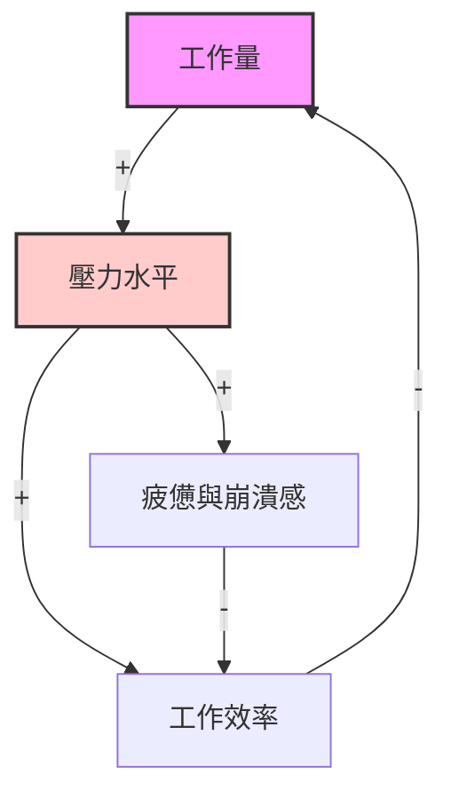
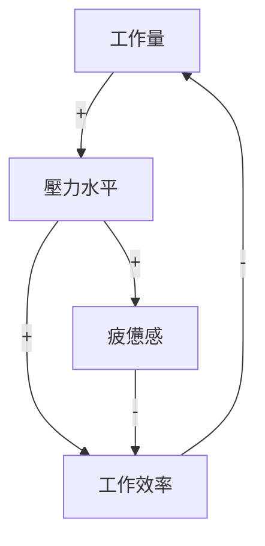

# CLD (因果關係圖) 系統思考與 Mermaid 繪製指南

本篇筆記整理了 **CLD (Causal Loop Diagram，因果關係圖)** 的核心概念，並展示如何在 Obsidian 中使用 Mermaid 語法來動態繪製與呈現因果關係圖。

---

## 1. 什麼是 CLD？

**因果關係圖 (Causal Loop Diagram, CLD)** 是系統思考 (Systems Thinking) 中用來視覺化系統內各變量之間相互關係與回饋機制 (Feedback Mechanisms) 的核心工具。

透過 CLD，我們能看清事件背後的「結構」，而非僅僅看到局部的因果，這有助於避免「治標不治本」的決策盲區。

---

## 2. CLD 的核心要素

一個標準的 CLD 由以下三個要素組成：

### ① 變量 (Variables)
系統中的元素、狀態或行為（例如：`工作壓力`、`產品品質`、`客戶滿意度`）。

### ② 連結與極性 (Links & Polarities)
箭頭表示因果關係的方向，箭頭旁的符號表示**極性**：
* ➕ **同向關係 (s / same)**：因與果呈同方向變化。
  * *例如：工作量 ➡️ (➕) ➡️ 疲憊感（工作量增加，疲憊感跟著增加；工作量減少，疲憊感也減少）。*
* ➖ **反向關係 (o / opposite)**：因與果呈反方向變化。
  * *例如：運動量 ➡️ (➖) ➡️ 體重（運動量增加，體重減少；運動量減少，體重增加）。*

### ③ 回饋迴路 (Feedback Loops)
當因果關係形成閉環時，即為回饋迴路：
* 🔄 **增強迴路 (Reinforcing Loop, R)**：
  * **特徵**：系統會自我放大（滾雪球效應）。可以是良性循環，也可以是惡性循環。
  * **識別**：閉環中「➖」號的數量為**偶數**（包括 0 個）。
* ⚖️ **調節迴路 (Balancing Loop, B)**：
  * **特徵**：系統會尋求穩定、自我修正，或向某個目標靠攏（如恆溫器）。
  * **識別**：閉環中「➖」號的數量為**奇數**。

---

## 3. 在 Obsidian 中使用 Mermaid 繪製 CLD

Obsidian 原生支援 **Mermaid** 圖表，我們可以使用 Mermaid 的 `graph` 語法來繪製因果圖：

### 範例：工作壓力與效率的 CLD



### 📋 程式碼範例（您可以複製至筆記中修改）：
````markdown

````

---

## 4. 今日新增與關聯索引

* 本筆記已被加入至 [[Notes/000_Index 索引：Obsidian 自動化專案|000_Index 索引：Obsidian 自動化專案]] 的導覽地圖中。
* 系統思考與心智圖的整理，可搭配 Obsidian 的 Canvas 畫布功能進行更直觀的排版。
