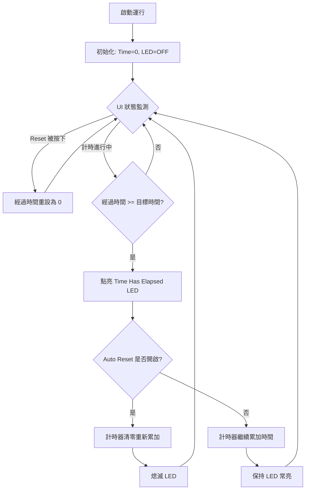

# Elapsed Time Express VI 邏輯拆解與流程圖

本篇筆記針對 **CLD 1 (經過時間 Express VI)** 與 **CLD 2 (功能性全域變數 FGV)** 進行深度模組化拆解，並依據實戰大綱規範進行整理。

---

## 📥 輸入控制 (Inputs)
* **Time Target (s) [目標時間]**：
  * **型態**：雙精度浮點數 (DBL)。
  * **用途**：設定計時器的目標秒數（CLD 1 預設 2 秒；CLD 2 預設 4 秒）。
* **Reset Button (Reset) [重設]**：
  * **型態**：布林值 (Boolean)。
  * **用途**：按壓時強制計時器將目前時間清零，並從 0 重新開始。
* **Auto Reset [自動重設]**：
  * **型態**：布林開關（預設為 ON）。
  * **用途**：決定當經過時間達到目標時間後，是否自動重設並進入下一個計時週期。
* **Timer Mode [FGV 模式列舉]** (僅 CLD 2 適用)：
  * **型態**：Enum（包含 `Reset`、`Set Auto Reset`、`Read Status`）。
  * **用途**：決定功能性全域變數 (FGV) 動作引擎的工作狀態。

---

## 📊 輸出顯示 (Outputs)
* **Elapsed Time (s) [已流逝時間]**：
  * **型態**：雙精度浮點數 (DBL)。
  * **用途**：持續顯示從計時開始到當前所經過的秒數（精度通常至小數點後兩位）。
* **Time Has Elapsed (Has Time Elapsed) [時間已到]**：
  * **型態**：LED 指示燈 (Boolean)。
  * **用途**：當流逝時間大於等於目標時間時亮起 (ON)，其餘時間熄滅 (OFF)。

---

## ⚙️ 核心邏輯 (Core Logic)

### ① 計時基本運作流程
計時器啟動後，時間開始由 0 累加，並不斷將數值傳送給 `Elapsed Time (s)`。
當 `Elapsed Time` \(\ge\) `Time Target` 時，觸發「時間已到」事件。

### ② 自動重設判定邏輯 (Auto Reset)
* **Auto Reset 為 ON 時**：
  ```
  [時間已到] LED 亮起 ➡️ 計時器瞬間清零 ➡️ 重新開始累加 ➡️ [時間已到] LED 熄滅
  ```
* **Auto Reset 為 OFF 時**：
  ```
  [時間已到] LED 亮起 ➡️ 計時器不予清零，繼續往上累加時間 ➡️ [時間已到] LED 保持常亮
  ```

### ③ Elapsed Time Express VI 流程圖 (Mermaid)



---

## 💡 CLD 實戰筆記 (自我檢討)

### 1. Express VI 的優缺點與適用場景
* **優點**：
  * 拖放即可使用，能非常快速地開發出簡單的定時應用程式。
* **缺點與限制**：
  * **重入性限制 (Re-entrancy)**：Express VI 預設是重入的 (Re-entrant)。這意味著若同一個 Express VI 被放置在多個不同地方，它們會擁有各自獨立的記憶體。這在大型狀態機中容易導致「計時不同步」的 Bug。
  * **控制精度較低**：無法進行微秒級的高精度計時。
  * **缺乏擴充性**：難以原生實作「暫停 (Pause) / 恢復 (Resume)」等複雜控制。

### 2. 用動作引擎 (Action Engine) / FGV 進行重構的價值
在 CLD 2 中，我們將計時器封裝進 FGV (功能性全域變數)。
* **好處**：
  * **單一記憶體特性**：解決了重入性帶來的不同步問題。無論在主程式的哪個狀態 (State) 呼叫此 FGV，讀取的都是同一個計時狀態。
  * **容易加入新功能**：可以輕易在 FGV 內加入 Shift Register，用以儲存「暫停時的流逝時間」，從而完美解決「暫停/恢復」這類 CLD 考試中極為常見的進階計時要求。
