# 🛠️ LabVIEW CLD 認證實戰練習與架構指南

本指南整合自 NotebookLM 中關於 **Certified LabVIEW Developer (CLD)** 認證考試的實戰資料。內容涵蓋 17 個循序漸進的實戰練習，以及考取 CLD 所需具備的四大核心架構設計、實作技巧與常見陷阱 (Gotchas)。

---

## 📈 評估標準與學習方針

> [!IMPORTANT]
> * **開發時間控制**：建議每題實戰練習應在 **30-45 分鐘** 內完成。若超過一小時，代表有知識缺口，需要回去複習。
> * **系統效能與正確性**：
>   * 事件順序必須正確。
>   * 指示燈與按鈕的啟用/停用 (Enable/Disable) 狀態控制要精準。
>   * 反應時間必須小於 **100ms** (避免使用 Wait 阻塞事件迴圈)。
>   * 計時的準確性：例如暫停與繼續時，絕對不可遺失先前已經過的時間。

---

## 🧭 四大核心技術路徑與 17 個實戰練習

```mermaid
graph TD
    MOC[CLD 實戰與架構指南] --> T[1. 核心計時架構 Timers]
    MOC --> F[2. 檔案讀寫與字串解析 File I/O]
    MOC --> S[3. 循序器與狀態機 Sequencers]
    MOC --> UI[4. UI 互動與流暢度 GUI]
    
    T --> T1[Ex 1: Express VI Timer]
    T --> T2[Ex 2: Express VI FGV]
    T --> T3[Ex 3: Action Engine Timer]
    T --> T4[Ex 4: Event Timeout]
    
    F --> F5[Ex 5: INI Config]
    F --> F6[Ex 6: CSV Utility]
    F --> F7[Ex 7: Date Parsing]
    F --> F8[Ex 8: CSV Commands]
    F --> F15[Ex 15: String parsing]
    
    S --> S9[Ex 9: Hardcoded Sequencer]
    S --> S10[Ex 10: Data-driven Sequencer]
    S --> S11[Ex 11: Producer/Consumer]
    S --> S12[Ex 12: Command State Machine]
    S --> S13[Ex 13: Flow Rates]
    S --> S14[Ex 14: Advanced Sequence]
    
    UI --> UI16[Ex 16: Dynamic Enable]
    UI --> UI17[Ex 17: GUI Keypad]
```

### 1. 核心計時架構 (Timers)
穩定且精確的計時器是 CLD 考試應用程式的心臟。

| 練習編號 | 練習名稱 | 核心概念 (Core Concepts) | 易錯內容 (Gotchas / Common Mistakes) | 關聯練習 |
| :--- | :--- | :--- | :--- | :--- |
| **Ex 1** | Elapsed Time Express VI Timer | 使用 Elapsed Time Express VI 開發基礎計時器，掌握 Auto Reset 與 Reset 的控制邏輯與指示燈反應。 | Express VI 預設為 **可重入 (Re-entrant)** 特性，在多次呼叫或不同迴圈中呼叫時，極易產生非預期的獨立計時狀態。 | [[CLD Exercise 2]], [[CLD Exercise 9]] |
| **Ex 2** | Elapsed Time Express VI FGV | 將 Ex 1 封裝進功能性全域變數 (FGV / Action Engine) 中。使用 Enum 控制 Reset, Set Auto Reset, Read Status，保留記憶體狀態。 | 挑戰題要求加入「暫停 (Pause)」功能，必須使用 **未初始化的移位暫存器 (Uninitialized Shift Register)** 來儲存先前的經過時間，若未正確儲存會導致暫停後時間歸零。 | [[CLD Exercise 1]], [[CLD Exercise 3]] |
| **Ex 3** | Action Engine Timer | 不依賴 Express VI，改以純 LabVIEW 函數（Get Date/Time in Seconds 或 Tick Count）實作包含暫停、繼續、讀取的 FGV 計時器。 | 使用 Tick Count (ms) 時必會遇到毫秒計時器 **歸零/溢位 (turnover)** 的邊界條件，設計時必須考量處理此例外。此外，暫停時的數值保留邏輯極易出錯。 | [[CLD Exercise 14]] |
| **Ex 4** | Event Structure Time Out | 利用事件結構 (Event Structure) 的 Timeout 節點作為計時器，並實作二進位位元計數器。 | 事件結構的 Timeout 特性是「只要有任何事件發生（如按按鈕），計時就會重新計算」，因此非常不適合用於精確或需要持續累加的經過時間測量。 | 獨立計時觀念探討 |

---

### 2. 檔案讀寫與字串解析 (File I/O & String Parsing)
資料通常來自外部檔案，需將其轉換為陣列與叢集供狀態機使用。

| 練習編號 | 練習名稱 | 核心概念 (Core Concepts) | 易錯內容 (Gotchas / Common Mistakes) | 關聯練習 |
| :--- | :--- | :--- | :--- | :--- |
| **Ex 5** | Reading and Writing Config | 讀寫設定檔 (.ini)。動態讀取數值、布林與字串叢集，並將資料寫入至指定的二維陣列 (2x4) 索引位置。 | 處理陣列時常見的 **零基索引 (zero-based indexing)** 概念，容易在計算行與列時發生 **差一錯誤 (Off-by-one error)**。 | [[CLD Exercise 6]], [[CLD Exercise 8]] |
| **Ex 6** | Comma Separated File Utility | 開發 CSV 檔案讀寫工具，將含有 Dwell Time 與三個布林值的資料行轉換為叢集陣列。 | 字串處理的大小寫問題（規格要求不區分大小寫 case insensitive）。必須正確使用字串轉換函數並確保陣列索引附加正確。 | [[CLD Exercise 10]], [[CLD Exercise 11]] |
| **Ex 7** | Date Stamp Parsing | 時間標籤 (Time Stamp) 拆解與字串格式化。將年、月、秒等獨立欄位重組為自訂的命令字串（如 `0 0 13 04 01 12 5 4 13 0 1 lvinit`）。 | 字串間的空白字元處理，特別是 **結尾不可有空白字元**。此外，世紀 (Century)、時間模式 (AM/PM) 等自訂代碼轉換邏輯繁瑣。 | [[CLD Exercise 15]] |
| **Ex 8** | CSV File Commands Utility | CSV 狀態指令讀取。將包含字串指令 (Command)、時間數值及三個布林值的 CSV 資料列轉換為資料叢集陣列。 | 處理資料列時，確保字串與數值的型態轉換節點正確無誤，並處理可能的空字元。 | [[CLD Exercise 12]] |
| **Ex 15** | CSV File Text String Parsing | 高階 CSV 字串解析與商業邏輯運算。將如 `091,TX78701Travis+02` 複雜字串拆解並重新寫回檔案。 | 正規表達式或字串分割的使用錯誤。價格折扣 (+/-) 的百分比轉換計算（例如字串 `-3` 必須轉換為 `0.97` 乘數）。 | [[CLD Exercise 7]] |

---

### 3. 循序器與狀態機架構 (Sequencers & State Machines)
將「計時」與「資料讀取」模組結合，打造具備執行步驟與控制邏輯的主程式。

| 練習編號 | 練習名稱 | 核心概念 (Core Concepts) | 易錯內容 (Gotchas / Common Mistakes) | 關聯練習 |
| :--- | :--- | :--- | :--- | :--- |
| **Ex 9** | Step Sequencer with Express Timer | 硬編碼的步驟循序器。使用三個寫死的目標時間常數與布林狀態，利用計時器完成訊號推動下一步。 | 強制覆寫機制（當 Time Target 輸入大於 0 時，必須無條件蓋過常數時間），以及在自動重置關閉時停止進入下一步的狀態流動控制。 | [[CLD Exercise 10]] |
| **Ex 10** | Step Sequencer Based on CSV Data | 資料驅動的循序器 (Data-driven Sequencer)。結合 Ex 6 讀取模組取代硬編碼，實現動態載入步驟與時間。 | 檔案資料與程式迴圈同步的問題，必須確保外部資料完全載入後，計時器與狀態機才可開始運作。 | [[CLD Exercise 6]], [[CLD Exercise 9]] |
| **Ex 11** | Producer Consumer Step Sequencer | 將 Ex 10 升級為 **生產者/消費者 (Producer/Consumer)** 雙迴圈架構，將 UI 指令與資料/計時邏輯分離。 | UI 指令（生產者）與計時/循序邏輯（消費者）之間的資料佇列 (Queue) 傳遞不能遺失，且重置與停止迴圈時的資源釋放必須同步。 | [[CLD Exercise 10]] |
| **Ex 12** | Sequencer State Machine | 指令驅動的狀態機 (Command-driven State Machine)。以 SetTime 或 RunState 等字串動態決定進入哪個 Case 執行。 | 字串比對時的大小寫容錯。必須確保執行的第一步強制為 SetTime，否則計時器預設為 0。 | [[CLD Exercise 8]] |
| **Ex 13** | Flow Rates | 模擬流量的連續變化與邏輯控制。包含依 250ms 更新數值、停止時速率遞減歸零等。 | 浮點數接近零時的判斷，以及速率遞減至精確數值 0 的邊界條件設計，容易產生邏輯死角。 | 獨立狀態機與系統模擬 |
| **Ex 14** | Timer App With File Targets | 進階計時狀態機，具備「暫停 (Pause)」與「取消 (Cancel) 目前步驟並跳至下一步」功能。 | 在暫停狀態下若按下 Cancel 鍵，必須同時解除暫停並直接跳入下一個目標時間，狀態切換間極易遺失計時資料。 | [[CLD Exercise 3]] |

---

### 4. UI 介面互動與流暢度控制 (UI Simulation)
確保程式控制項隨時處於正確的邏輯狀態，避免使用者誤觸造成系統崩潰。

| 練習編號 | 練習名稱 | 核心概念 (Core Concepts) | 易錯內容 (Gotchas / Common Mistakes) | 關聯練習 |
| :--- | :--- | :--- | :--- | :--- |
| **Ex 16** | State Machine with Enables and Disables | UI 控制項的動態啟用/停用。依據當前系統數值動態改變 UI 狀態（例如數量為 0 禁用 Use，數量為 10 禁用 Fill）。 | 若要求按鈕點擊後需停用 250 毫秒，若直接使用 Wait 函數會阻塞 UI 事件迴圈，需設計非阻塞（Non-blocking）寫法。另外注意大量 Property Node 帶來的延遲。 | UI 控制流模擬 |
| **Ex 17** | GUI Keypad Simulation | GUI 鍵盤模擬。使用字串連續拼接記錄鍵盤點擊，確認時轉換為數值輸出。 | 字串與數值切換間的移位暫存器更新。按下清除鍵 'C' 時，字串必須重置為字元 '0' 而非空字串 ''。 | UI 反應速度及動態字串處理 |

---

## 🔗 雙向連結關係
* 總入口索引：[[Notes/000_Index 索引：Obsidian 自動化專案]]
* 上游 MOC：[[💡 CLD 實戰筆記（自我檢討）]]
* 單元連結：[[CLD/Elapsed Time Express VI 邏輯拆解與流程圖]]

---

## 🗂️ 模擬考題綜合實戰連結 (Mock Exams)
這 17 個單元練習的基礎架構將會在以下 4 個 CLD 經典模擬考題中進行綜合實作，您可以參閱對應的英文規格與架構拆解：
* 🏧 **[[CLD_sample_exams_english/ATM Exam|CLD Exam: Automated Teller Machine (ATM)]]**
* 🔥 **[[CLD_sample_exams_english/Boiler Exam|CLD Exam: Boiler Controller]]**
* 🚗 **[[CLD_sample_exams_english/Car Wash Exam|CLD Exam: Car Wash Controller]]**
* 🌧️ **[[CLD_sample_exams_english/Sprinkler Exam|CLD Exam: Sprinkler Controller]]**
