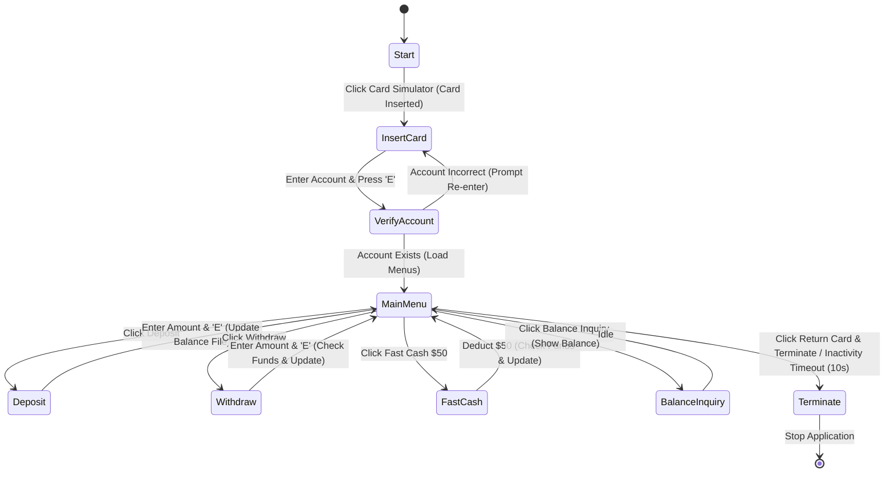

# 🏧 CLD Exam: Automated Teller Machine (ATM)

* **考試代碼**：`100928C-01`
* **主題類別**：模擬提款機系統控制流

---

## 🎯 題目目標 (Objective)
設計一個 Automated Teller Machine (ATM) 控制器。使用者可透過前面板進行存款 (Deposit)、提款 (Withdraw) 與餘額查詢 (Balance Inquiry)。系統需讀寫 `Accounts.txt` 檔案，並在 10 秒無動作時自動逾時退出。

---

## 🧭 運作順序狀態機 (Sequence of Operation)



---

## 🗂️ 檔案規格 (Accounts.txt Specification)
* **格式**：CSV 格式純文字檔，位於 main VI 同一目錄下。
* **資料欄位**：`Account Number (5 digits), First Name, Last Name, Balance`
* **初始測試資料**：
  ```csv
  12345,John,Doe,550
  23456,Jennifer,Rodriguez,1000
  34567,Bryan,Smith,750
  45678,Julie,Ramirez,900
  ```

---

## 🔗 與 CLD_Guide 練習之雙向連結
為實現此考題的各項規格，強烈建議搭配下列基礎模組：
* **CSV 帳號檔案讀取與更新**：
  * ↳ [[CLD_Guide/CLD Exercise 6|CLD Exercise 6 (Comma Separated File Utility)]] —— 用於解析 CSV 每行資料。
  * ↳ [[CLD_Guide/CLD Exercise 8|CLD Exercise 8 (CSV File Commands Utility)]] —— 高階 CSV 欄位拆解。
* **10 秒閒置逾時停止機制**：
  * ↳ [[CLD_Guide/CLD Exercise 3|CLD Exercise 3 (Action Engine Timer)]] —— 以非阻塞方式於背景計算使用者無操作時間，時間一到發出退出訊號。
* **UI 控制項啟用與停用狀態**：
  * ↳ [[CLD_Guide/CLD Exercise 16|CLD Exercise 16 (State Machine with Enables and Disables)]] —— 插入卡片前 disable 所有按鈕，插入後啟用主選單。
