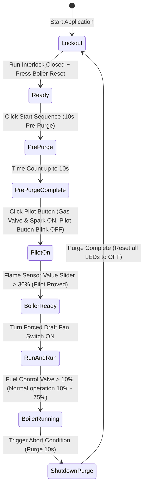

# 🔥 CLD Exam: Boiler Controller

* **考試代碼**：`100926F-01`
* **主題類別**：鍋爐啟動與安全連鎖控制

---

## 🎯 題目目標 (Objective)
設計一個鍋爐啟動控制器，允許使用者安全地啟動和關閉鍋爐。系統必須控制 Primary Fan、Natural Gas Valve、Spark Ignition 等輸出，且每次狀態轉換都必須詳細記錄至 `Boiler Log.txt` 檔案中。

---

## 🧭 運作順序狀態機 (Sequence of Operation)

> [!IMPORTANT]
> **異常中止條件 (Shutdown & Purge Trigger)**:
> 1. 按下 Boiler Shutdown 按鈕。
> 2. 燃料閥位置 (Fuel Control Valve Position) 小於 10% 或大於 75%。
> 3. 運轉連鎖開關 (Run Interlock Switch) 開啟。
> 4. 強制通風扇 (Forced Draft Fan) 關閉。

---

## 🗂️ 日誌規格 (Boiler Log.txt Specification)
* **檔名**：`Boiler Log.txt` (CSV 格式)
* **資料欄位**：`Timestamp, Event, Event Data`
* **格式說明**：絕對日期時間、事件名稱、事件數據。若檔案不存在則新建並寫入 Header，若已存在則附加寫入。

---

## 🔗 與 CLD_Guide 練習之雙向連結
為實現此考題的各項規格，強烈建議搭配下列基礎模組：
* **10 秒 Pre-Purge 與 Purge 精確計時器**：
  * ↳ [[CLD_Guide/CLD Exercise 3|CLD Exercise 3 (Action Engine Timer)]] —— 包含計時、暫停與重置的純函數計時器。
  * ↳ [[CLD_Guide/CLD Exercise 9|CLD Exercise 9 (Step Sequencer with Elapsed Time Express VI Timer)]] —— 循序步驟計時。
* **UI 狀態切換與 blinks 控制**：
  * ↳ [[CLD_Guide/CLD Exercise 16|CLD Exercise 16 (State Machine with Enables and Disables)]] —— 依據 Flame Sensor 值與閥門開度，動態使能按鈕或使 Pilot 按鈕閃爍。
* **Boiler Log 檔案 CSV 讀寫與資料附加**：
  * ↳ [[CLD_Guide/CLD Exercise 6|CLD Exercise 6 (Comma Separated File Utility)]] —— CSV 行寫入附加機制。
