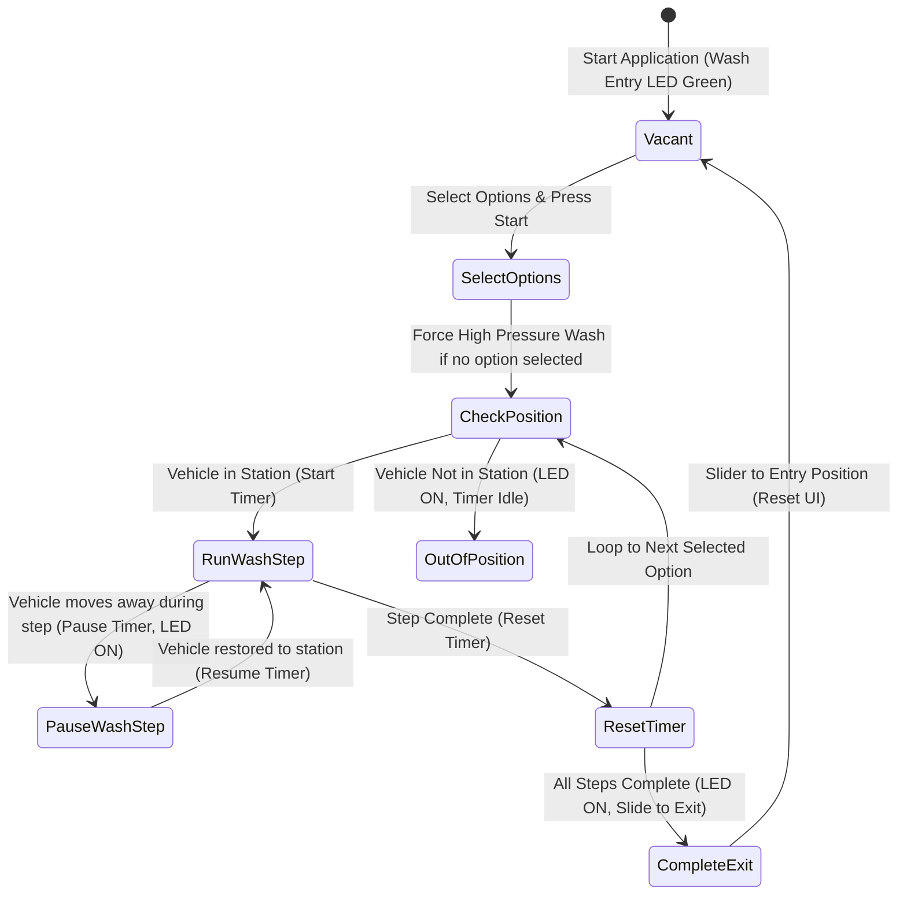

# 🚗 CLD Exam: Car Wash Controller

* **考試代碼**：`100929B-01`
* **主題類別**：自動洗車與車輛定位控制

---

## 🎯 題目目標 (Objective)
設計一個洗車控制器，模擬洗車機的流程控制。使用者可勾選不同的洗車流程（Under Body Wash, Bug Remover, Pre-Soak 等），系統依位置滑桿 (Car Position Slider) 決定洗車程序是否執行或因「位置偏離」而暫停計時。

---

## 🧭 運作順序狀態機 (Sequence of Operation)

---

## 📋 洗洗車步驟與對應測站關係表

| 洗車步驟 (Wash Steps) | 單步時間 (Step Time) | 對應站別 (Station) |
| :--- | :--- | :--- |
| **Under Body Wash** | 5 seconds | Station 1 |
| **Bug Remover** | 5 seconds | Station 1 |
| **Pre-Soak** | 5 seconds | Station 2 |
| **High Pressure Wash** (預設) | 5 seconds | Station 2 |
| **Low Pressure Wax** | 5 seconds | Station 2 |
| **Spot Free Rinse** | 5 seconds | Station 2 |
| **Tire Shine Foam** | 5 seconds | Station 3 |
| **Air Dry** | 5 seconds | Station 3 |

---

## 🔗 與 CLD_Guide 練習之雙向連結
為實現此考題的各項規格，強烈建議搭配下列基礎模組：
* **具有「暫停 (Pause)」與「繼續 (Resume)」功能的計時器**：
  * ↳ [[CLD_Guide/CLD Exercise 2|CLD Exercise 2 (Elapsed Time Express VI FGV)]] —— 包含 Pause 狀態與 Uninitialized Shift Register 實作。
  * ↳ [[CLD_Guide/CLD Exercise 14|CLD Exercise 14 (Timer Application With File Time Targets)]] —— 進階計時暫停、解除暫停與直接跳過。
* **多步驟動態循序選擇與防呆**：
  * ↳ [[CLD_Guide/CLD Exercise 10|CLD Exercise 10 (Step Sequencer Based on CSV Data)]] —— 動態資料驅動步驟。
  * ↳ [[CLD_Guide/CLD Exercise 12|CLD Exercise 12 (Sequencer State Machine)]] —— 指令驅動狀態機，動態決定進入哪個 Wash Step 執行。
