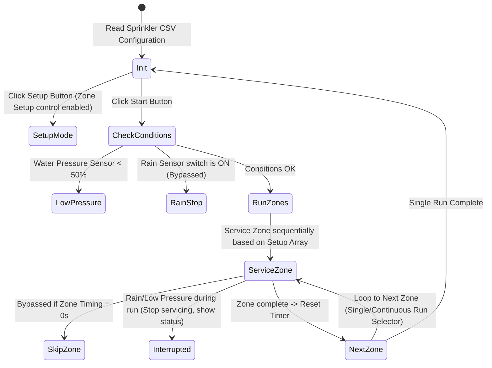

# 🌧️ CLD Exam: Sprinkler Controller

* **考試代碼**：`100927F-01`
* **主題類別**：多區段灑水計時與感測中斷控制

---

## 🎯 題目目標 (Objective)
設計一個四區段（North, East, South, West）的灑水控制器。程式啟動時需自動從 CSV 設定檔載入各區段的順序與秒數。系統具備單次/連續執行模式，並於「下雨 (Rain)」或「低水壓 (Low Water Pressure)」時立刻中斷或跳過。

---

## 🧭 運作順序狀態機 (Sequence of Operation)

---

## 🔗 與 CLD_Guide 練習之雙向連結
為實現此考題的各項規格，強烈建議搭配下列基礎模組：
* **CSV 設定檔讀取與 Zone Setup 陣列初始化**：
  * ↳ [[CLD_Guide/CLD Exercise 6|CLD Exercise 6 (Comma Separated File Utility)]] —— 基礎 CSV 讀取。
  * ↳ [[CLD_Guide/CLD Exercise 10|CLD Exercise 10 (Step Sequencer Based on CSV Data)]] —— 自定義 CSV 與計時狀態機結合。
* **灑水時間計時與跳過 (Timing = 0s)**：
  * ↳ [[CLD_Guide/CLD Exercise 9|CLD Exercise 9 (Step Sequencer with Elapsed Time Express VI Timer)]] —— 當目標時間為 0 時無條件跳過該步驟的邏輯。
* **下雨或低壓中斷/恢復後的狀態處理**：
  * ↳ [[CLD_Guide/CLD Exercise 14|CLD Exercise 14 (Timer Application With File Time Targets)]] —— 用於中斷、暫停與重新調度。
