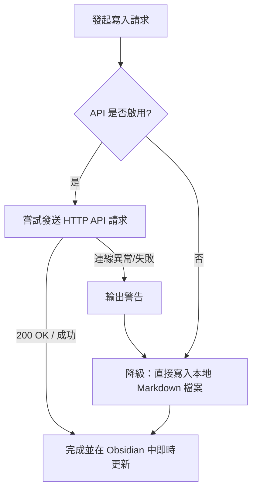

# Obsidian 自動化工具核心邏輯

本篇筆記整理了我們所設計的 [obsidian_tool.py](file:///k:/Antigravity_folio/obsidian/obsidian_tool.py) 核心架構與底層邏輯，作為日後維護與擴充的參考。

---

## 1. 設定檔讀取與 API Key 智慧過濾
* **機制描述**：
  啟動時程式會讀取 `config.json`，判定是否啟用 API 模式 (`API_ENABLED`)。
* **智慧容錯處理**：
  許多使用者從 Obsidian 插件中複製金鑰時，會不小心連同協定頭 `"Bearer "` 一起複製（如 `"Bearer 9bbea..."`）。
  程式碼中實作了自動修剪邏輯，防止在請求標頭中重複出現雙重 Bearer 導致 `401 Unauthorized` 錯誤：
  ```python
  API_KEY = config.get("api_key")
  if API_KEY.startswith("Bearer "):
      API_KEY = API_KEY[len("Bearer "):].strip()
  ```

---

## 2. API 優先與本地雙模寫入 (Fallback)
這是此工具最核心的架構設計。程式在執行任何寫入指令（如建立筆記、追加日記）時，均採用 **API 優先，連線失敗自動降級** 的原則：



### 🎯 API 寫入細節：
* **安全性警告忽略**：
  由於 Obsidian Local REST API 預設在本地背景執行 HTTPS 且採用自簽憑證，程式中使用了 `urllib3.disable_warnings` 來屏蔽 SSL 警告，並在 `requests` 請求中設定 `verify=False`。
* **一般筆記建立**：
  使用 `PUT /vault/{folder}/{safe_title}.md` 覆寫或新建檔案。
* **日記的智慧判斷**：
  1. 先發送 `GET` 請求檢查今日日記是否已存在。
  2. **若不存在**：套用預設的 Markdown 日記範本，以 `PUT` 建立檔案。
  3. **若已存在**：將新增內容打包為 `### 隨筆追加 (HH:MM:SS)`，以 `POST` 發送，API 會自動將內容追加至檔案最尾端。

---

## 3. 本地檔案直接寫入 (降級模式)
當 Obsidian 程式未開啟、或是金鑰未填寫時，程式會直接操作本地路徑：
* **新建筆記**：利用 `open(file_path, "w")` 寫入。
* **日記追加**：檢查 `os.path.exists`，不存在則以 `"w"` 建立，存在則以 `"a"` (append) 模式直接向檔案尾端追加寫作內容。

---

## 4. 自動喚醒與 UI 定位 (Obsidian URI)
在指令後加上 `-o` 或 `--open` 時，工具會呼叫 Windows 系統的 URL 協定：
* **核心命令**：
  ```python
  obsidian_uri = f"obsidian://open?path={encoded_path}"
  subprocess.run(["cmd", "/c", "start", obsidian_uri], check=True)
  ```
* **效果**：
  此寫法使用**絕對路徑**作為參數，因此即使使用者沒有事先在 Obsidian 中註冊該資料夾名稱，Obsidian 也能準確識別該目錄並開啟，甚至能直接跳轉並在編輯器中呈現特定筆記。
