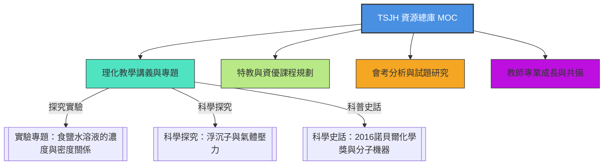

# 淡水國中理化與資優教學資源總庫 MOC

本篇為 `L:\tsjh`（淡水國中理化與資優班教學資源庫）的總導覽地圖，整合了原創講義、共備研習、特教資優及會考分析的重點筆記，提供有系統的雙向關聯網絡。

---

## 🧭 一、四大整合筆記入口

1. 🧪 [[TSJH/淡水國中理化教學講義與專題彙整|淡水國中理化教學講義與專題彙整]]
   * 涵蓋：有機物與酸鹼、熱學公式 \(H = m \cdot s \cdot \Delta T\)、固液壓力公式 \(P = h \cdot d\)、阿基米德浮力定律與化學反應計量。
2. 🧬 [[TSJH/淡水國中特教與資優班課程規劃|淡水國中特教與資優班課程規劃]]
   * 涵蓋：生物資優探究課程、107科學營講義、特教班級行政與分組名單。
3. 📊 [[TSJH/淡水國中理化會考分析與模擬考試題研究|淡水國中理化會考分析與模擬考試題研究]]
   * 涵蓋：110年會考自然科試題分析、控制變因命題策略、模擬考大數據分析。
4. 🤝 [[TSJH/淡水國中教師專業成長與跨校共備紀錄|淡水國中教師專業成長與跨校共備紀錄]]
   * 涵蓋：板土共備簡報、文山區共備研討、素養導向數位評量命題趨勢。

---

## 🔬 二、核心探究與科學史獨立大作
* [[TSJH/實驗專題：食鹽水溶液的濃度與密度關係|實驗專題：食鹽水溶液的濃度與密度關係]] —— 濃度與密度實驗、誤差防範。
* [[TSJH/科學探究：浮沉子與氣體壓力|科學探究：浮沉子與氣體壓力]] —— 浮力與波以耳定律應用。
* [[TSJH/科學史話：2016諾貝爾化學獎與分子機器|科學史話：2016諾貝爾化學獎與分子機器]] —— 拓樸化學、交環烷、輪烷。

---

## 🔗 知識地圖連結
* 主索引入口：[[Notes/000_Index 索引：Obsidian 自動化專案]]
* 公式知識地圖：[[Science/國高中理化核心公式與定律總整理]]
